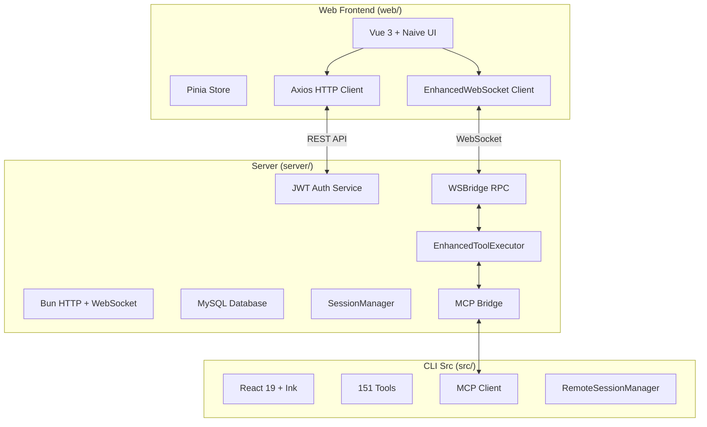

# Claude Code HAHA - 深度集成计划

## 项目概述

本项目旨在深度集成 Claude Code HAHA 的 server 与 CLI (src)，让 web 前端能够利用 CLI 的完整工具系统和 MCP 支持。

## 架构设计



## 已完成的功能

### Phase 1: 协议层统一

- [x] 扩展 WebSocket RPC 方法，支持工具执行
- [x] 添加 REST API 端点 (`/api/tools/*`)
- [x] 增强 WebSocket 客户端，支持工具执行事件
- [x] 添加工具相关的类型定义

**新增 API 端点:**

| 方法 | 路径 | 描述 |
|------|------|------|
| GET | `/api/tools` | 获取所有工具列表 |
| GET | `/api/tools/:name` | 获取特定工具详情 |
| POST | `/api/tools/execute` | 执行工具 |
| GET | `/api/tools/history` | 获取工具执行历史 |
| POST | `/api/tools/history/clear` | 清空历史 |
| POST | `/api/tools/validate` | 验证工具输入 |

**新增 WebSocket RPC 方法:**

| 方法 | 描述 |
|------|------|
| `tool.list` | 列出所有工具 |
| `tool.execute` | 执行工具 |
| `tool.executeStreaming` | 流式执行工具 |
| `tool.history` | 获取执行历史 |
| `tool.clearHistory` | 清空历史 |
| `tool.validateInput` | 验证输入 |

### Phase 2: 工具系统与 MCP 集成

- [x] 集成增强工具执行器 (15+ 工具)
- [x] 实现 MCP 服务器管理 API
- [x] 添加内置 MCP 工具 (fs_read, fs_write, search_grep 等)
- [x] 添加工具执行权限和沙箱系统

**MCP API 端点:**

| 方法 | 路径 | 描述 |
|------|------|------|
| GET | `/api/mcp/servers` | 获取 MCP 服务器列表 |
| POST | `/api/mcp/servers` | 添加 MCP 服务器 |
| DELETE | `/api/mcp/servers/:id` | 移除服务器 |
| PUT | `/api/mcp/servers/:id/toggle` | 启用/禁用服务器 |
| POST | `/api/mcp/servers/:id/test` | 测试连接 |
| GET | `/api/mcp/tools` | 获取 MCP 工具列表 |
| POST | `/api/mcp/call` | 调用 MCP 工具 |
| GET | `/api/mcp/status` | 获取 MCP 状态 |

**内置 MCP 工具:**

- `fs_read` - 读取文件
- `fs_write` - 写入文件
- `fs_list` - 列出目录
- `fs_stat` - 获取文件状态
- `search_grep` - 搜索文件内容
- `search_glob` - 模式匹配文件
- `process_exec` - 执行 Shell 命令

**权限系统:**

- 工具权限检查 (`canExecuteTool`)
- 路径访问控制 (`isPathAllowed`)
- 沙箱配置支持
- 执行超时控制

### Phase 3: Web UI 组件

- [x] `ToolExecution.vue` - 工具执行可视化组件
- [x] `ToolPanel.vue` - 工具面板组件
- [x] `MCPServers.vue` - MCP 服务器管理界面
- [x] `FileEditor.vue` - Web 文件编辑器组件
- [x] `MonitoringPanel.vue` - 性能监控面板组件
- [x] 增强的 WebSocket 事件处理

### Phase 4: 性能和错误处理

- [x] 统一的错误处理工具 (`errorHandler.ts`)
- [x] 集成测试文件 (`integration.test.ts`)
- [x] `performanceMonitor.ts` - 性能监控和日志系统
- [x] `mcpClient.ts` - MCP 客户端管理器（支持 stdio/websocket/http 传输）

### Phase 5: MCP 服务器远程连接

- [x] 支持 stdio 传输协议
- [x] 支持 WebSocket 传输协议
- [x] 支持 SSE 传输协议
- [x] 支持 StreamableHTTP 传输协议
- [x] 内置文件系统工具（fs_read, fs_write, fs_list, fs_stat）
- [x] 内置搜索工具（search_grep, search_glob）
- [x] 内置进程工具（process_exec）
- [x] 服务器连接测试功能
- [x] 告警系统

### Phase 6: CLI 工具动态加载系统

- [x] CLI 工具动态加载器 (`cliToolLoader.ts`)
- [x] 工具适配器模式实现
- [x] 工具别名支持
- [x] 工具类别自动识别
- [x] 内置工具适配器注册（file_read, file_write, file_edit, glob, grep, bash, web_search, web_fetch, todo_write, config）
- [x] 条件编译支持框架
- [x] 工具发现和热更新

**新增模块:**

| 模块 | 文件 | 描述 |
|------|------|------|
| `CLIToolLoader` | `integrations/cliToolLoader.ts` | CLI 工具动态加载器 |
| `CLIToolAdapter` | `integrations/cliToolLoader.ts` | CLI 工具适配器 |
| `TOOL_CATEGORIES` | `integrations/cliToolLoader.ts` | 工具类别常量 |

**CLI 工具适配器:**

```typescript
// 注册自定义工具适配器
const adapter = new CLIToolAdapter(
  'my_tool',
  '工具描述',
  { type: 'object', properties: {...}, required: [...] },
  async (args) => { /* 执行逻辑 */ },
  { aliases: ['alias1'], isReadOnly: () => true }
)
```

### Phase 7: 工具注册中心

- [x] 统一工具注册中心 (`toolRegistry.ts`)
- [x] 多源工具管理（builtin/cli/mcp/custom）
- [x] 工具权限控制
- [x] 工具执行历史
- [x] 工具统计和分组
- [x] 事件系统（tool_start/tool_end）
- [x] 工具搜索功能

**新增模块:**

| 模块 | 文件 | 描述 |
|------|------|------|
| `ToolRegistry` | `integrations/toolRegistry.ts` | 统一工具注册中心 |
| `RegisteredTool` | `integrations/toolRegistry.ts` | 工具注册接口 |
| `TOOL_CATEGORIES` | `integrations/toolRegistry.ts` | 工具类别定义 |

**工具来源:**

- `builtin`: 内置工具（FileRead, Bash, WebSearch 等）
- `cli`: 从 CLI src/tools.ts 动态加载
- `mcp`: MCP 服务器提供的工具
- `custom`: 用户自定义工具

### Phase 8: MCP SDK 完整实现

- [x] 完整 MCP JSON-RPC 协议实现 (`mcpSdkIntegration.ts`)
- [x] MCP Client 类实现
- [x] MCP 服务器连接管理器
- [x] 工具调用支持
- [x] 资源订阅/读取支持
- [x] 提示词模板支持
- [x] 协议版本协商
- [x] 错误处理

**新增模块:**

| 模块 | 文件 | 描述 |
|------|------|------|
| `MCPClient` | `integrations/mcpSdkIntegration.ts` | MCP 客户端 |
| `MCPServerConnectionManager` | `integrations/mcpSdkIntegration.ts` | MCP 服务器管理器 |
| `MCP_PROTOCOL_VERSION` | `integrations/mcpSdkIntegration.ts` | 协议版本常量 |
| `MCP_ERROR_CODES` | `integrations/mcpSdkIntegration.ts` | 错误码定义 |

**MCP 协议方法:**

```typescript
// 初始化
await client.connect()

// 列出工具
const tools = client.getTools()

// 调用工具
const result = await client.callTool('tool_name', { arg1: 'value' })

// 读取资源
const resource = await client.readResource('file://path')

// 订阅资源
await client.subscribeResource('file://path')
```

### Phase 9: Skills 系统集成

- [x] Skills 动态加载器 (`skillLoader.ts`)
- [x] 支持 Markdown 和 JavaScript/TypeScript 格式
- [x] 技能元信息解析（name, description, tags, category）
- [x] 技能参数验证
- [x] 技能模板替换
- [x] 技能分类管理
- [x] 技能搜索功能
- [x] 示例技能自动创建

**新增模块:**

| 模块 | 文件 | 描述 |
|------|------|------|
| `SkillLoader` | `integrations/skillLoader.ts` | 技能加载器 |
| `SkillDefinition` | `integrations/skillLoader.ts` | 技能定义接口 |
| `DEFAULT_SKILL_CATEGORIES` | `integrations/skillLoader.ts` | 默认技能类别 |

**支持的技能格式:**

```markdown
---
name: 我的技能
description: 技能描述
category: code
tags: [生成, 代码]
version: 1.0.0
author: 作者名
---

# 技能标题

技能内容，支持 {{variable}} 变量替换。
```

## 快速开始

### 1. 启动服务器

```bash
cd server
bun install
bun run src/index.ts
```

服务器将启动在 `http://localhost:3000`

### 2. 启动 Web 前端

```bash
cd web
bun install
bun run dev
```

前端将启动在 `http://localhost:5173`

### 3. 使用工具

**通过 REST API:**

```bash
# 获取工具列表
curl http://localhost:3000/api/tools

# 执行工具
curl -X POST http://localhost:3000/api/tools/execute \
  -H "Content-Type: application/json" \
  -d '{"toolName": "Bash", "toolInput": {"command": "ls -la"}}'
```

**通过 WebSocket:**

```javascript
const ws = new WebSocket('ws://localhost:3000/ws')

// 列出工具
ws.send(JSON.stringify({
  type: 'rpc_call',
  id: '1',
  method: 'tool.list'
}))

// 执行工具
ws.send(JSON.stringify({
  type: 'rpc_call',
  id: '2',
  method: 'tool.execute',
  params: {
    toolName: 'Bash',
    toolInput: { command: 'pwd' }
  }
}))
```

## 项目结构

```
claude-code-haha/
├── server/                    # Bun HTTP 服务器
│   └── src/
│       ├── index.ts          # 主入口
│       ├── routes/           # API 路由
│       │   └── monitoring.ts # 监控 API
│       ├── integration/
│       │   ├── wsBridge.ts  # WebSocket RPC 桥接
│       │   ├── enhancedToolExecutor.ts  # 工具执行器
│       │   ├── webStore.ts  # Web 状态管理
│       │   └── performanceMonitor.ts  # 性能监控
│       ├── integrations/
│       │   ├── mcpBridge.ts   # MCP 桥接
│       │   ├── mcpClient.ts   # MCP 客户端管理器
│       │   ├── mcpSdkIntegration.ts  # MCP SDK 完整实现
│       │   ├── cliToolLoader.ts  # CLI 工具动态加载
│       │   ├── toolRegistry.ts   # 统一工具注册中心
│       │   ├── skillLoader.ts   # Skills 系统
│       │   ├── commandBridge.ts  # 命令桥接
│       │   ├── agentRunner.ts   # Agent 运行器
│       │   └── sessionBridge.ts # 会话桥接
│       ├── services/
│       │   ├── authService.ts
│       │   └── sessionManager.ts
│       └── db/               # 数据库层
│
├── src/                      # CLI 源码 (553 files)
│   ├── tools/               # 151 个工具
│   ├── services/mcp/       # MCP 客户端
│   └── ...
│
└── web/                      # Vue 3 前端
    └── src/
        ├── components/
        │   ├── ToolExecution.vue
        │   ├── ToolPanel.vue
        │   ├── MCPServers.vue
        │   ├── FileEditor.vue      # 文件编辑器
        │   └── MonitoringPanel.vue  # 监控面板
        ├── views/
        │   └── MCPServers.vue
        ├── api/
        │   ├── toolApi.ts
        │   └── mcpApi.ts
        └── composables/
            └── useWebSocket.ts
```

## 环境变量

### Server (.env)

```bash
# Anthropic 配置
ANTHROPIC_AUTH_TOKEN=your_token
ANTHROPIC_BASE_URL=https://dashscope.aliyuncs.com
ANTHROPIC_MODEL=qwen-plus

# 数据库
DB_HOST=localhost
DB_PORT=3306
DB_USER=root
DB_PASSWORD=your_password
DB_NAME=claude_code_haha

# JWT
JWT_SECRET=your_secret
JWT_EXPIRATION=24h

# 服务器
PORT=3000

# 沙箱配置
SANDBOX_ENABLED=false
ALLOWED_PATHS=D:\Projects
DENIED_PATHS=**/node_modules/**,**/.git/**
SANDBOX_MAX_EXECUTION_TIME=60000
```

### Web (.env)

```bash
VITE_API_BASE_URL=http://localhost:3000
```

## 下一步

### Phase 10: 集成工作台完善

- [ ] 集成诊断面板：显示所有集成组件的健康状态
- [ ] 工具调用可视化：实时显示工具执行流程
- [ ] MCP 服务器状态仪表盘
- [ ] 技能市场界面

### Phase 11: 高级功能

- [ ] 文件监视系统（chokidar 集成）
- [ ] 沙箱隔离（isolated-vm 集成）
- [ ] 远程会话同步
- [ ] 团队协作功能

### Phase 12: CLI 完整集成

- [ ] 完整 151 个工具从 src/tools.ts 动态加载
- [ ] 工具版本管理
- [ ] 工具更新检测
- [ ] 工具权限精细控制

### Phase 13: 性能优化

- [ ] 工具执行缓存
- [ ] MCP 连接池
- [ ] 会话消息压缩
- [ ] 前端虚拟滚动优化

### Phase 14: 文档和测试

- [ ] API 文档自动生成
- [ ] 集成测试套件
- [ ] E2E 测试
- [ ] 性能基准测试

## Web 集成接入进度（维护）

### 已完成项目

| 项目 | 状态 | 说明 |
|------|------|------|
| 集成工作台 | ✅ | 路由 `/integration`、侧栏入口、Tab（工具/MCP/文件/监控） |
| 工具列表为空 | ✅ | 前端解析统一响应体 `data`；删除服务端存根避免覆盖 |
| MCP 移除/测试连接 | ✅ | URL 使用 `server.id` |
| vue-tsc 全绿 | ✅ | 无未使用导入、类型正确、参数一致 |
| 集成工作台布局 | ✅ | 去掉过窄 `max-width`、右侧详情自适应 |
| CLI 工具加载器 | ✅ | `cliToolLoader.ts` 实现动态加载 |
| 工具注册中心 | ✅ | `toolRegistry.ts` 统一管理 |
| MCP SDK 集成 | ✅ | `mcpSdkIntegration.ts` 完整协议 |
| Skills 系统 | ✅ | `skillLoader.ts` 动态技能加载 |

### 待处理项目

- [ ] `MonitoringPanel` 中 `fetch('/api/monitoring/...')` 与 axios 基地址策略统一（可选）
- [ ] 集成诊断面板
- [ ] 工具执行流程可视化

## 许可证

MIT
