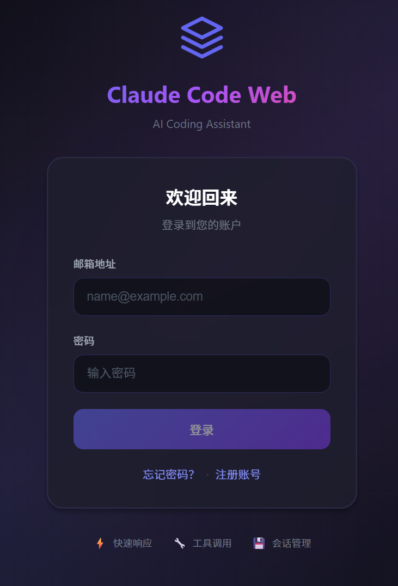
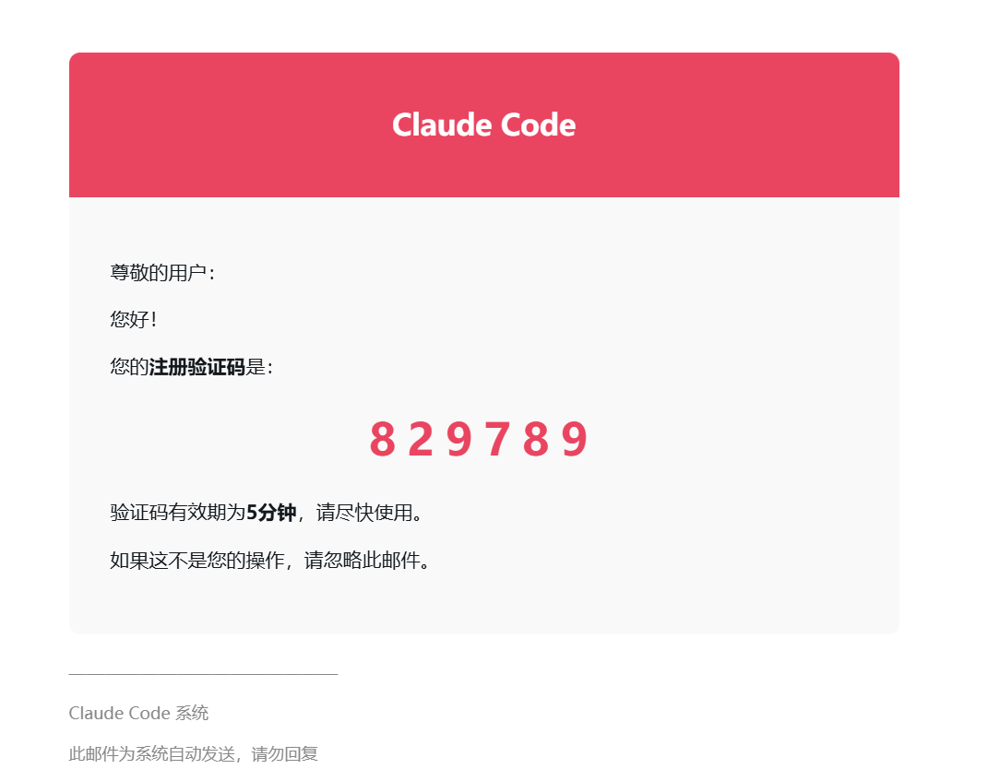
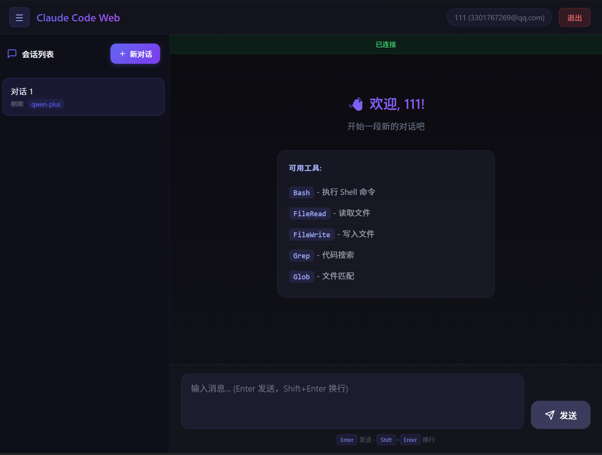

# Claude Code Web

<p align="right"><strong>中文</strong> | <a href="./README.en.md">English</a></p>

Claude Code 的 **Web 界面版本**，支持接入任意 Anthropic 兼容 API（如 MiniMax、OpenRouter 等），提供完整的 AI 对话和工具调用能力。

> 本项目是 Claude Code 的 Web 前端实现，配合 WebSocket 服务器实现会话管理、用户认证等功能。

<p align="center">
  
</p>

## 功能

- 完整的 Web 交互界面
- 支持 MCP 服务器、插件、Skills
- 支持自定义 API 端点和模型
- **WebSocket 服务器**支持会话管理和 AI 对话
- **用户认证系统**（注册、登录、找回密码）

### claw-web 登录界面

<p align="center">
  
</p>

### claw-web 注册邮箱

<p align="center">
  
</p>

### claw-web 聊天界面

<p align="center">
  
</p>

---

## 快速开始

### 1. 安装 Bun

本项目运行依赖 [Bun](https://bun.sh)。如果你的电脑还没有安装 Bun，可以先执行下面任一方式：

```bash
# macOS / Linux（官方安装脚本）
curl -fsSL https://bun.sh/install | bash
```

如果在精简版 Linux 环境里提示 `unzip is required to install bun`，先安装 `unzip`：

```bash
# Ubuntu / Debian
apt update && apt install -y unzip
```

```bash
# macOS（Homebrew）
brew install bun
```

```powershell
# Windows（PowerShell）
powershell -c "irm bun.sh/install.ps1 | iex"
```

安装完成后，重新打开终端并确认：

```bash
bun --version
```

### 2. 安装项目依赖

```bash
bun install
```

### 3. 配置环境变量

复制示例文件并填入你的 API Key：

```bash
cp .env.example .env
```

编辑 `.env`：

```env
# API 认证（二选一）
ANTHROPIC_API_KEY=sk-xxx          # 标准 API Key（x-api-key 头）
ANTHROPIC_AUTH_TOKEN=sk-xxx       # Bearer Token（Authorization 头）

# API 端点（可选，默认 Anthropic 官方）
ANTHROPIC_BASE_URL=https://api.minimaxi.com/anthropic

# 模型配置
ANTHROPIC_MODEL=MiniMax-M2.7-highspeed
ANTHROPIC_DEFAULT_SONNET_MODEL=MiniMax-M2.7-highspeed
ANTHROPIC_DEFAULT_HAIKU_MODEL=MiniMax-M2.7-highspeed
ANTHROPIC_DEFAULT_OPUS_MODEL=MiniMax-M2.7-highspeed

# 超时（毫秒）
API_TIMEOUT_MS=3000000

# 禁用遥测和非必要网络请求
DISABLE_TELEMETRY=1
CLAUDE_CODE_DISABLE_NONESSENTIAL_TRAFFIC=1
```

### 4. 启动

#### 启动服务器

```bash
cd server
bun install
bun run src/index.ts
```

#### 启动 Web 前端

```bash
cd web
bun install
bun run dev
```

服务器默认运行在 `ws://localhost:3000` 和 `http://localhost:3000`
Web 前端默认运行在 `http://localhost:5173`

---

## API 端点

| 端点                                    | 方法   | 说明            |
| ------------------------------------- | ---- | ------------- |
| `/api/health`                         | GET  | 健康检查          |
| `/api/models`                         | GET  | 获取可用模型列表      |
| `/api/tools`                          | GET  | 获取可用工具列表      |
| `/api/auth/register/send-code`        | POST | 发送注册验证码       |
| `/api/auth/register`                  | POST | 用户注册          |
| `/api/auth/login`                     | POST | 用户登录          |
| `/api/auth/forgot-password/send-code` | POST | 发送重置密码验证码     |
| `/api/auth/forgot-password`           | POST | 重置密码          |
| `/api/auth/me`                        | GET  | 获取当前用户信息（需认证） |

### 认证流程

#### 1. 发送注册验证码

```bash
curl -X POST http://localhost:3000/api/auth/register/send-code \
  -H "Content-Type: application/json" \
  -d '{"email": "user@example.com"}'
```

#### 2. 注册

```bash
curl -X POST http://localhost:3000/api/auth/register \
  -H "Content-Type: application/json" \
  -d '{
    "email": "user@example.com",
    "username": "用户名",
    "password": "123456",
    "code": "123456"
  }'
```

#### 3. 登录

```bash
curl -X POST http://localhost:3000/api/auth/login \
  -H "Content-Type: application/json" \
  -d '{
    "email": "user@example.com",
    "password": "123456"
  }'
```

登录成功返回：

```json
{
  "success": true,
  "data": {
    "accessToken": "eyJhbGciOiJIUzI1NiIsInR5cCI6IkpXVCJ9...",
    "tokenType": "Bearer",
    "userId": "uuid",
    "username": "用户名",
    "email": "user@example.com",
    "isAdmin": false,
    "avatar": "/avatars/default.png"
  }
}
```

#### 4. 找回密码

发送重置密码验证码：

```bash
curl -X POST http://localhost:3000/api/auth/forgot-password/send-code \
  -H "Content-Type: application/json" \
  -d '{"email": "user@example.com"}'
```

重置密码：

```bash
curl -X POST http://localhost:3000/api/auth/forgot-password \
  -H "Content-Type: application/json" \
  -d '{
    "email": "user@example.com",
    "code": "123456",
    "newPassword": "newpassword123"
  }'
```

#### 5. 获取当前用户

```bash
curl http://localhost:3000/api/auth/me \
  -H "Authorization: Bearer your_access_token"
```

### WebSocket 消息类型

| 消息类型             | 说明          |
| ---------------- | ----------- |
| `register`       | 注册新用户       |
| `login`          | 通过 token 登录 |
| `create_session` | 创建新对话会话     |
| `load_session`   | 加载会话历史      |
| `list_sessions`  | 获取用户会话列表    |
| `user_message`   | 发送用户消息      |
| `delete_session` | 删除会话        |
| `rename_session` | 重命名会话       |
| `clear_session`  | 清除会话消息      |

### 数据库配置

服务器使用 MySQL 数据库。配置以下环境变量：

```env
DB_HOST=localhost
DB_PORT=3306
DB_USER=root
DB_PASSWORD=your_password
DB_NAME=claude_code_web
JWT_SECRET=your-super-secret-key-change-in-production-min-32-chars
JWT_EXPIRATION=24h
```

---

## 环境变量说明

| 变量                                         | 必填    | 说明                                        |
| ------------------------------------------ | ----- | ----------------------------------------- |
| `ANTHROPIC_API_KEY`                        | 二选一   | API Key，通过 `x-api-key` 头发送                |
| `ANTHROPIC_AUTH_TOKEN`                     | 二选一   | Auth Token，通过 `Authorization: Bearer` 头发送 |
| `ANTHROPIC_BASE_URL`                       | 否     | 自定义 API 端点，默认 Anthropic 官方                |
| `ANTHROPIC_MODEL`                          | 否     | 默认模型                                      |
| `ANTHROPIC_DEFAULT_SONNET_MODEL`           | 否     | Sonnet 级别模型映射                             |
| `ANTHROPIC_DEFAULT_HAIKU_MODEL`            | 否     | Haiku 级别模型映射                              |
| `ANTHROPIC_DEFAULT_OPUS_MODEL`             | 否     | Opus 级别模型映射                               |
| `API_TIMEOUT_MS`                           | 否     | API 请求超时，默认 600000 (10min)                |
| `DISABLE_TELEMETRY`                        | 否     | 设为 `1` 禁用遥测                               |
| `CLAUDE_CODE_DISABLE_NONESSENTIAL_TRAFFIC` | 否     | 设为 `1` 禁用非必要网络请求                          |
| `DB_HOST`                                  | 服务器模式 | 数据库主机                                     |
| `DB_PORT`                                  | 服务器模式 | 数据库端口                                     |
| `DB_USER`                                  | 服务器模式 | 数据库用户名                                    |
| `DB_PASSWORD`                              | 服务器模式 | 数据库密码                                     |
| `DB_NAME`                                  | 服务器模式 | 数据库名称                                     |
| `JWT_SECRET`                               | 服务器模式 | JWT 密钥（生产环境必须修改）                          |
| `JWT_EXPIRATION`                           | 服务器模式 | JWT 过期时间                                  |

---

## 项目结构

```
web/                      # Web 前端
├── src/
│   ├── App.vue          # 主应用组件
│   ├── components/      # UI 组件
│   └── services/        # API 服务
server/                   # WebSocket 服务器
├── src/
│   ├── index.ts         # 服务器主入口
│   ├── db/              # 数据库连接和 schema
│   ├── models/          # 数据类型定义
│   └── services/        # 业务服务（认证、会话管理、JWT）
```

---

## 技术栈

| 类别     | 技术                                     |
| ------ | -------------------------------------- |
| 运行时    | [Bun](https://bun.sh)                  |
| 语言     | TypeScript                             |
| 前端框架  | Vue 3                                  |
| 构建工具  | Vite                                   |
| API    | Anthropic SDK                          |
| 服务器    | Bun.serve (WebSocket + REST)           |
| 数据库    | MySQL                                  |
| 认证     | JWT + bcrypt                           |

---

## Disclaimer

本项目是 Claude Code 的 Web 版本实现。所有原始源码版权归 [Anthropic](https://www.anthropic.com) 所有。仅供学习和研究用途。
