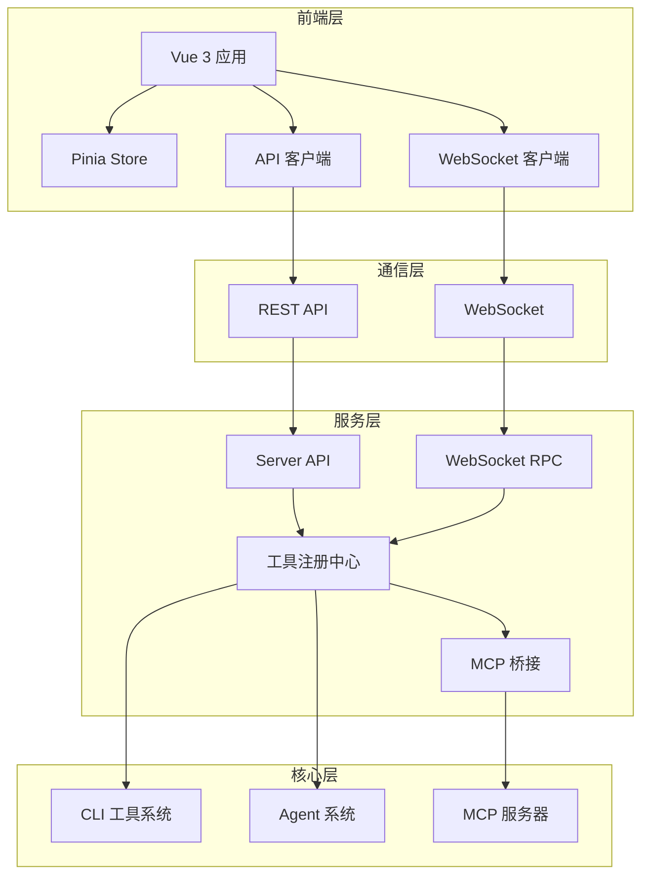

# Claude Code HAHA 前端集成适配文档

**文档版本**: 1.0  
**创建日期**: 2026-04-05  
**最后更新**: 2026-04-05

---

## 目录

1. [项目概述](#项目概述)
2. [技术栈](#技术栈)
3. [架构设计](#架构设计)
4. [核心功能模块](#核心功能模块)
5. [API 集成](#api-集成)
6. [WebSocket 通信](#websocket-通信)
7. [组件系统](#组件系统)
8. [状态管理](#状态管理)
9. [已完成功能](#已完成功能)
10. [待完善功能](#待完善功能)
11. [开发指南](#开发指南)
12. [部署指南](#部署指南)

---

## 项目概述

### 项目简介

Claude Code HAHA 的前端是一个现代化的 Web 应用程序，基于 Vue 3 技术栈构建，提供了与 Claude Code HAHA 后端系统深度集成的用户界面。前端系统支持：

- 🤖 AI 对话与 Agent 协作
- 🔧 151+ 工具执行与可视化
- 🔌 MCP (Model Context Protocol) 服务器集成
- 📚 技能 (Skills) 系统管理
- 📊 性能监控与诊断
- 👥 多用户会话管理

### 项目结构

```
claude-code-haha/web/
├── src/
│   ├── api/                      # API 客户端模块
│   │   ├── toolApi.ts           # 工具管理 API
│   │   ├── mcpApi.ts            # MCP 管理 API
│   │   ├── skillApi.ts          # 技能管理 API
│   │   ├── sessionApi.ts        # 会话管理 API
│   │   ├── authApi.ts           # 认证 API
│   │   ├── client.ts            # Axios 基础配置
│   │   └── unwrapApiResponse.ts # 响应解析工具
│   ├── components/               # Vue 组件
│   │   ├── common/              # 通用组件
│   │   ├── messages/            # 消息展示组件
│   │   ├── ToolPanel.vue        # 工具面板
│   │   ├── ToolExecution.vue    # 工具执行组件
│   │   ├── MonitoringPanel.vue  # 监控面板
│   │   ├── SkillMarket.vue      # 技能市场
│   │   ├── DiagnosticPanel.vue  # 诊断面板
│   │   └── ...                  # 其他组件
│   ├── composables/              # Vue 组合式函数
│   │   ├── useWebSocket.ts      # WebSocket 客户端
│   │   ├── useAgentIntegration.ts # Agent 集成
│   │   └── useTheme.ts          # 主题管理
│   ├── stores/                  # Pinia 状态管理
│   │   ├── auth.ts              # 认证状态
│   │   ├── chat.ts              # 聊天状态
│   │   └── settings.ts          # 设置状态
│   ├── types/                   # TypeScript 类型定义
│   │   ├── tool.ts              # 工具类型
│   │   ├── agent.ts             # Agent 类型
│   │   ├── websocket.ts         # WebSocket 类型
│   │   └── ...                  # 其他类型
│   ├── utils/                   # 工具函数
│   │   ├── errorHandler.ts      # 错误处理
│   │   ├── markdown.ts          # Markdown 解析
│   │   └── toolParser.ts        # 工具解析
│   ├── views/                   # 页面视图
│   │   ├── Chat.vue             # 聊天页面
│   │   ├── IntegrationHub.vue   # 集成工作台
│   │   ├── MCPServers.vue       # MCP 服务器管理
│   │   └── ...                  # 其他页面
│   ├── App.vue                  # 根组件
│   ├── main.ts                  # 应用入口
│   └── router.ts                # 路由配置
├── package.json                 # 依赖配置
├── vite.config.ts               # Vite 配置
└── tsconfig.json                # TypeScript 配置
```

---

## 技术栈

### 核心框架

| 技术 | 版本 | 用途 |
|------|------|------|
| Vue | 3.4.21 | 前端框架 |
| TypeScript | 5.4.2 | 类型安全 |
| Vite | 5.1.6 | 构建工具 |
| Vue Router | 4.3.0 | 路由管理 |
| Pinia | 2.1.7 | 状态管理 |
| Naive UI | 2.38.1 | UI 组件库 |

### 辅助库

| 技术 | 版本 | 用途 |
|------|------|------|
| Axios | 1.6.7 | HTTP 客户端 |
| jwt-decode | 4.0.0 | JWT 解码 |
| marked | 12.0.0 | Markdown 渲染 |
| highlight.js | 11.9.0 | 代码高亮 |
| @vicons/ionicons5 | 0.12.0 | 图标库 |

### 开发工具

| 技术 | 版本 | 用途 |
|------|------|------|
| ESLint | - | 代码检查 |
| Prettier | 3.8.1 | 代码格式化 |
| sass-embedded | 1.99.0 | SCSS 支持 |

---

## 架构设计

### 整体架构



### 数据流设计

#### 1. REST API 数据流

```
用户操作 → Vue 组件 → API 客户端 → REST API → Server → 工具/Agent
    ↑                                                              ↓
    └──────────────── 响应数据 ←────────────────────────────────┘
```

#### 2. WebSocket 实时数据流

```
用户连接 → WebSocket 握手 → 会话建立 → 实时双向通信
    ↑                                              ↓
    └──────── 事件推送 ←─────────────────────────┘
```

---

## 核心功能模块

### 1. 认证模块

**文件位置**: `src/stores/auth.ts`, `src/api/authApi.ts`

**功能特性**:
- 用户注册/登录
- JWT Token 管理
- GitHub OAuth 登录
- 登录状态持久化
- Token 自动刷新

**关键类型定义**:

```typescript
// src/types/auth.ts
export interface User {
  id: string
  username: string
  email: string
  avatar?: string
}

export interface AuthState {
  user: User | null
  token: string | null
  isAuthenticated: boolean
}
```

### 2. 聊天与会话模块

**文件位置**: `src/stores/chat.ts`, `src/views/Chat.vue`

**功能特性**:
- 多会话管理
- 实时消息流
- 消息历史保存
- 工具调用可视化
- 会话重命名/删除

**关键组件**:
- `ChatMessageList.vue` - 消息列表
- `ChatInput.vue` - 输入框
- `SessionSidebar.vue` - 会话侧边栏

### 3. 工具系统模块

**文件位置**: `src/api/toolApi.ts`, `src/components/ToolPanel.vue`

**功能特性**:
- 工具列表展示（按类别分组）
- 工具详情查看
- 工具执行与结果展示
- 工具执行历史
- 工具输入验证

**工具类别**:
- `file` - 文件操作
- `shell` - Shell 命令
- `web` - 网络工具
- `system` - 系统工具
- `ai` - AI 工具
- `mcp` - MCP 工具

### 4. MCP 服务器管理模块

**文件位置**: `src/api/mcpApi.ts`, `src/views/MCPServers.vue`

**功能特性**:
- MCP 服务器注册/删除
- 连接状态监控
- MCP 工具列表
- MCP 工具调用
- 多种传输协议支持（stdio, websocket, sse, streamable-http）

**内置 MCP 工具**:
- `fs_read` - 读取文件
- `fs_write` - 写入文件
- `fs_list` - 列出目录
- `search_grep` - 搜索文件内容
- `process_exec` - 执行 Shell 命令

### 5. Agent 集成模块

**文件位置**: `src/composables/useAgentIntegration.ts`

**功能特性**:
- Agent 选择与切换
- Agent 执行状态跟踪
- Agent 消息展示
- Agent 中断控制
- 后台任务支持

**可用 Agent**:
- `general-purpose` - 通用助手
- `Explore` - 探索者（只读）
- `Plan` - 规划师
- `verification` - 验证者
- `claude-code-guide` - 使用指南
- `statusline-setup` - 状态栏设置

### 6. Agent 工作流可视化模块 (Phase 10)

**文件位置**: `src/components/AgentWorkflowViewer.vue`, `src/components/AgentActivitySidebar.vue`

**功能特性**:
- 递归树形工作流可视化
- 实时 Agent 状态跟踪
- 工具调用详情展开
- 子 Agent 嵌套显示
- 权限拦截与审批
- 团队拓扑图
- 后台任务看板
- 权限模式选择器

**新增组件**:

| 组件 | 功能 |
|------|------|
| `AgentWorkflowViewer.vue` | 递归树形工作流可视化 |
| `AgentActivitySidebar.vue` | Agent 活动侧边栏（整合所有可视化组件） |
| `AgentTeamPanel.vue` | 多 Agent 团队拓扑可视化 |
| `BackgroundTasksPanel.vue` | 后台任务看板 |
| `PermissionInterceptor.vue` | 权限拦截与审批 UI |
| `PermissionModeSelector.vue` | 权限模式选择器 |

**新增类型**: `src/types/agentWorkflow.ts`

| 类型 | 描述 |
|------|------|
| `AgentWorkflowEvent` | 工作流事件统一类型 |
| `WorkflowUpdatePayload` | 工作流更新载荷 |
| `ToolCallStartPayload` | 工具调用开始载荷 |
| `PermissionRequiredPayload` | 权限请求载荷 |
| `TeamTopology` | 团队拓扑结构 |
| `BackgroundTask` | 后台任务 |
| `PermissionMode` | 权限模式枚举 |

### 6. 集成工作台

**文件位置**: `src/views/IntegrationHub.vue`

**功能特性**:
- 统一的集成界面
- 工具面板 Tab
- MCP 服务器 Tab
- 技能市场 Tab
- 性能监控 Tab
- 诊断面板

---

## API 集成

### API 基础配置

**文件**: `src/api/client.ts`

```typescript
import axios from 'axios'

const apiClient = axios.create({
  baseURL: import.meta.env.VITE_API_BASE_URL || 'http://localhost:3000/api',
  timeout: 30000,
  headers: {
    'Content-Type': 'application/json',
  },
})

// 请求拦截器：添加认证 Token
apiClient.interceptors.request.use((config) => {
  const token = localStorage.getItem('token')
  if (token) {
    config.headers.Authorization = `Bearer ${token}`
  }
  return config
})

// 响应拦截器：统一错误处理
apiClient.interceptors.response.use(
  (response) => response,
  (error) => {
    // 错误处理逻辑
    return Promise.reject(error)
  }
)

export default apiClient
```

### 工具 API

**文件**: `src/api/toolApi.ts`

| 方法 | 端点 | 描述 |
|------|------|------|
| `listTools()` | `GET /tools` | 获取工具列表 |
| `getTool(toolName)` | `GET /tools/:name` | 获取工具详情 |
| `executeTool(request)` | `POST /tools/execute` | 执行工具 |
| `getHistory(limit)` | `GET /tools/history` | 获取执行历史 |
| `clearHistory()` | `POST /tools/history/clear` | 清空历史 |
| `validateInput(request)` | `POST /tools/validate` | 验证工具输入 |

**使用示例**:

```typescript
import toolApi from '@/api/toolApi'

// 获取工具列表
const response = await toolApi.listTools()
console.log(response.tools)

// 执行工具
const result = await toolApi.executeTool({
  toolName: 'Bash',
  toolInput: { command: 'ls -la' },
})
```

### MCP API

**文件**: `src/api/mcpApi.ts`

| 方法 | 端点 | 描述 |
|------|------|------|
| `listServers()` | `GET /mcp/servers` | 获取 MCP 服务器列表 |
| `listTools(serverName)` | `GET /mcp/tools` | 获取 MCP 工具列表 |
| `callTool(request)` | `POST /mcp/call` | 调用 MCP 工具 |
| `addServer(request)` | `POST /mcp/servers` | 添加 MCP 服务器 |
| `removeServer(serverId)` | `DELETE /mcp/servers/:id` | 删除 MCP 服务器 |
| `testConnection(serverId)` | `POST /mcp/servers/:id/test` | 测试连接 |

### Agent API

**文件**: `src/api/agentApi.ts`

| 方法 | 端点 | 描述 |
|------|------|------|
| `executeAgent(request)` | `POST /api/agents/execute` | 执行 Agent 任务 |
| `interruptAgent(agentId)` | `POST /api/agents/:id/interrupt` | 中断 Agent |
| `approvePermission(permissionId)` | `POST /api/agents/:id/approve` | 审批权限 |
| `spawnTeam(request)` | `POST /api/agents/team/spawn` | 创建团队 |
| `getTeamTopology(teamId)` | `GET /api/agents/team/:id/topology` | 获取团队拓扑 |
| `listTasks(status)` | `GET /api/tasks` | 获取后台任务 |
| `getTaskStatus(taskId)` | `GET /api/tasks/:id/status` | 获取任务状态 |
| `getAgentState(agentId)` | `GET /api/agents/:id/state` | 获取 Agent 状态 |
| `decomposeTask(task)` | `POST /api/agents/decompose` | 分解任务 |

---

## WebSocket 通信

### 增强版 WebSocket 客户端

**文件**: `src/composables/useWebSocket.ts`

**核心特性**:
- ✅ 自动重连（指数退避）
- ✅ 心跳检测
- ✅ RPC 调用封装
- ✅ 消息队列
- ✅ 事件订阅系统
- ✅ 连接状态监控

### 连接管理

```typescript
import wsClient from '@/composables/useWebSocket'

// 建立连接
await wsClient.connect(token)

// 断开连接
wsClient.disconnect()

// 检查连接状态
console.log(wsClient.isConnected.value)
```

### 事件订阅

```typescript
// 订阅事件
const unsubscribe = wsClient.on('session_list', (data) => {
  console.log('会话列表:', data)
})

// 取消订阅
unsubscribe()

// 订阅所有事件
wsClient.on('*', (data) => {
  console.log('收到事件:', data)
})
```

### RPC 调用

```typescript
// 列出工具
const tools = await wsClient.listTools()

// 执行工具
const result = await wsClient.executeTool(
  'Bash',
  { command: 'pwd' },
  sessionId
)

// 列出 MCP 服务器
const servers = await wsClient.listMCPServers()
```

### WebSocket 消息类型

#### 会话相关

| 类型 | 描述 |
|------|------|
| `register` | 注册用户 |
| `login` | 用户登录 |
| `create_session` | 创建会话 |
| `load_session` | 加载会话 |
| `list_sessions` | 获取会话列表 |
| `delete_session` | 删除会话 |
| `rename_session` | 重命名会话 |

#### 消息相关

| 类型 | 描述 |
|------|------|
| `user_message` | 发送用户消息 |
| `message_start` | 消息开始 |
| `content_block_delta` | 内容增量 |
| `message_stop` | 消息停止 |

#### 工具相关

| 类型 | 描述 |
|------|------|
| `tool_use` | 工具调用开始 |
| `tool_start` | 工具执行开始 |
| `tool_end` | 工具执行结束 |
| `tool_error` | 工具执行错误 |
| `tool_progress` | 工具执行进度 |

#### Agent 工作流相关

| 类型 | 描述 |
|------|------|
| `agent_event` | Agent 工作流事件 |
| `tool_call_start` | 工具调用开始 |
| `tool_call_end` | 工具调用结束 |
| `tool_call_error` | 工具调用错误 |
| `permission_required` | 权限请求 |
| `task_status_changed` | 任务状态变化 |
| `teammate_spawned` | 团队成员创建 |

**Agent 事件载荷示例**:
```typescript
{
  type: 'WORKFLOW_UPDATE',
  traceId: 'task_8899',
  agentId: 'sub_agent_explore',
  timestamp: 1712299452000,
  payload: {
    status: 'RUNNING',
    actionType: 'TOOL_CALL',
    message: '正在使用 FileRead 读取 package.json',
    toolName: 'FileRead',
    input: { path: 'package.json' }
  }
}
```

---

## 组件系统

### 核心组件

#### 1. 工具面板 (`ToolPanel.vue`)

**功能**:
- 工具列表按类别展示
- 工具筛选
- 工具详情查看
- 权限标签显示

**Props**: 无  
**Events**: 无

#### 2. 工具执行 (`ToolExecution.vue`)

**功能**:
- 工具参数输入
- 执行按钮
- 实时结果展示
- 执行状态显示

#### 3. MCP 服务器管理 (`MCPServers.vue`)

**功能**:
- 服务器列表
- 添加/删除服务器
- 连接状态显示
- 测试连接

#### 4. 集成工作台 (`IntegrationHub.vue`)

**功能**:
- 多 Tab 切换
- 工具面板 Tab
- MCP 服务器 Tab
- 技能市场 Tab
- 性能监控 Tab
- 诊断面板

#### 5. Agent 活动侧边栏 (`AgentActivitySidebar.vue`)

**功能**:
- 整合所有 Agent 可视化组件
- Tab 切换：工作流 / 团队 / 任务 / 设置
- 权限拦截器集成
- 实时状态统计
- 权限模式快速切换

**Props**:
```typescript
interface Props {
  show: boolean              // 显示状态
  defaultTab?: string        // 默认 Tab: 'workflow' | 'team' | 'tasks' | 'settings'
}
```

**Events**:
```typescript
@step-click   // 点击工作流步骤
@agent-click  // 点击 Agent 节点
@update:show  // 更新显示状态
```

### 消息组件

#### 1. 用户消息 (`UserMessage.vue`)

展示用户发送的消息。

#### 2. 助手消息 (`AssistantMessage.vue`)

展示 AI 回复，支持 Markdown 渲染和代码高亮。

#### 3. 工具调用消息 (`ToolUseMessage.vue`)

展示工具调用过程和结果。

#### 4. 思考消息 (`ThinkingMessage.vue`)

展示 AI 思考过程（流式输出时的加载状态）。

---

## 状态管理

### 1. 认证 Store (`auth.ts`)

**文件**: `src/stores/auth.ts`

**状态**:
- `user` - 当前用户信息
- `token` - JWT Token
- `isAuthenticated` - 认证状态

**方法**:
- `login()` - 用户登录
- `logout()` - 用户登出
- `fetchUser()` - 获取用户信息
- `syncUserFromToken()` - 从 Token 同步用户

### 2. 聊天 Store (`chat.ts`)

**文件**: `src/stores/chat.ts`

**状态**:
- `sessions` - 会话列表
- `currentSessionId` - 当前会话 ID
- `messages` - 消息列表
- `toolCalls` - 工具调用列表
- `isLoading` - 加载状态
- `isConnected` - 连接状态

**方法**:
- `connect(token)` - 连接 WebSocket
- `disconnect()` - 断开连接
- `createSession(title, model, force)` - 创建会话
- `loadSession(sessionId)` - 加载会话
- `listSessions()` - 获取会话列表
- `sendMessage(content, model)` - 发送消息
- `deleteSession(sessionId)` - 删除会话
- `renameSession(sessionId, title)` - 重命名会话

**事件监听**:
```typescript
// 会话列表更新
wsClient.on('session_list', (data) => {
  sessions.value = data.sessions
})

// 消息增量
wsClient.on('content_block_delta', (data) => {
  // 更新消息内容
})

// 工具调用开始
wsClient.on('tool_use', (data) => {
  // 添加工具调用记录
})
```

### 3. 设置 Store (`settings.ts`)

**文件**: `src/stores/settings.ts`

**状态**:
- `theme` - 当前主题
- `model` - 默认模型
- `language` - 语言设置

### 4. Agent Store (`agent.ts`)

**文件**: `src/stores/agent.ts`

**状态**:
- `traces` - Trace 状态集合（Map）
- `agents` - Agent 状态集合（Map）
- `currentTraceId` - 当前活跃的 traceId
- `agentConfig` - Agent 配置
- `pendingPermissions` - 等待审批的权限请求
- `teams` - 团队拓扑结构
- `backgroundTasks` - 后台任务列表

**方法**:
- `setCurrentTrace(traceId)` - 设置当前活跃 Trace
- `createTrace(title, rootAgentName)` - 创建新的 Trace
- `spawnAgent(traceId, parentAgentId, name)` - 派生子 Agent
- `updateAgentStatus(traceId, agentId, status)` - 更新 Agent 状态
- `addWorkflowStep(traceId, agentId, step)` - 添加工作流步骤
- `handleAgentEvent(event)` - 处理 WebSocket 事件
- `approvePermission(permissionId, approved)` - 审批权限请求
- `refreshBackgroundTasks()` - 刷新后台任务列表
- `setupWebSocketListeners()` - 设置 WebSocket 监听

### 5. Agent API (`agentApi.ts`)

**文件**: `src/api/agentApi.ts`

**功能**:
- Agent 执行与控制
- 多 Agent 团队管理
- 后台任务管理
- 任务分解
- 上下文隔离

**主要方法**:
```typescript
// 执行
executeAgent(request: ExecuteAgentRequest)
interruptAgent(agentId: string)
approvePermission(permissionId: string)

// 团队
spawnTeam(request: SpawnTeamRequest)
getTeamTopology(teamId: string)
sendMessageToAgent(agentId: string, message: string)

// 任务
listTasks(status?: string)
getTaskStatus(taskId: string)
cancelTask(taskId: string)

// 工具
getAgentState(agentId: string)
listActiveAgents()
decomposeTask(task: string)

---

## 已完成功能

### ✅ Phase 1: 基础架构

- [x] Vue 3 + TypeScript 项目初始化
- [x] Vite 构建配置
- [x] Naive UI 组件库集成
- [x] Pinia 状态管理
- [x] Vue Router 路由配置
- [x] 主题系统（明暗主题）

### ✅ Phase 2: 认证与用户系统

- [x] 用户注册/登录页面
- [x] JWT Token 管理
- [x] GitHub OAuth 集成
- [x] 路由守卫
- [x] 认证状态持久化

### ✅ Phase 3: 聊天与会话

- [x] 聊天页面布局
- [x] 会话侧边栏
- [x] 消息列表展示
- [x] 消息输入组件
- [x] 实时消息流
- [x] Markdown 渲染
- [x] 代码高亮
- [x] 会话创建/删除/重命名

### ✅ Phase 4: WebSocket 通信

- [x] 增强版 WebSocket 客户端
- [x] 自动重连机制
- [x] 心跳检测
- [x] RPC 调用封装
- [x] 事件订阅系统
- [x] 消息队列

### ✅ Phase 5: 工具系统集成

- [x] 工具 API 客户端
- [x] 工具面板组件
- [x] 工具执行组件
- [x] 工具列表按类别分组
- [x] 工具详情展示
- [x] 工具执行历史
- [x] 工具输入验证

### ✅ Phase 6: MCP 集成

- [x] MCP API 客户端
- [x] MCP 服务器管理页面
- [x] 服务器连接状态监控
- [x] MCP 工具列表展示
- [x] MCP 工具调用
- [x] 多种传输协议支持

### ✅ Phase 7: Agent 集成

- [x] Agent 集成 composable
- [x] Agent 选择器
- [x] Agent 执行状态跟踪
- [x] Agent 消息展示
- [x] Agent 中断控制

### ✅ Phase 8: 集成工作台

- [x] 集成工作台路由
- [x] 多 Tab 布局
- [x] 工具面板 Tab
- [x] MCP 服务器 Tab
- [x] 技能市场 Tab
- [x] 性能监控 Tab
- [x] 诊断面板

### ✅ Phase 9: 性能与监控

- [x] 性能监控组件
- [x] 诊断面板
- [x] 错误处理工具
- [x] TypeScript 类型完整覆盖
- [x] ESLint 检查全绿

---

## 待完善功能

### 🔄 Phase 10: 高级功能

- [x] 集成诊断面板健康状态展示
- [x] 工具执行流程可视化
- [x] MCP 服务器状态仪表盘
- [x] 技能市场界面完善
- [x] Agent 工作流树形可视化
- [x] 权限拦截与审批 UI
- [x] 团队拓扑图
- [x] 后台任务看板
- [x] 权限模式选择器
- [x] Agent 活动侧边栏

### 🔄 Phase 11: 性能优化

- [ ] 前端虚拟滚动优化（长消息列表）
- [ ] 工具执行缓存
- [ ] MCP 连接池
- [ ] 会话消息压缩

### 🔄 Phase 12: 测试与文档

- [ ] E2E 测试（Playwright）
- [ ] 单元测试（Vitest）
- [ ] API 文档自动生成
- [ ] 用户使用指南

---

## 开发指南

### 环境要求

- Node.js 18+
- npm 或 bun
- Windows/macOS/Linux

### 本地开发

#### 1. 安装依赖

```bash
cd claude-code-haha/web

# 使用 npm
npm install

# 或使用 bun（推荐）
bun install
```

#### 2. 配置环境变量

创建 `.env` 文件：

```env
VITE_API_BASE_URL=http://localhost:3000
```

#### 3. 启动开发服务器

```bash
# 使用 npm
npm run dev

# 或使用 bun
bun run dev
```

前端将启动在 `http://localhost:5173`

#### 4. 代码检查

```bash
# 运行 ESLint
npm run lint

# 自动修复
npm run lint -- --fix
```

#### 5. 类型检查

```bash
npm run build
```

### 代码规范

#### 1. 命名规范

- 组件文件：PascalCase (`ToolPanel.vue`)
- 组合式函数：camelCase 前缀 `use` (`useWebSocket.ts`)
- 类型定义：PascalCase (`ToolDefinition`)
- 常量：UPPER_SNAKE_CASE (`API_BASE_URL`)

#### 2. 文件结构

```typescript
// 组件文件结构
<script setup lang="ts">
// 1. 导入
import { ref, computed } from 'vue'

// 2. 类型定义
interface Props {
  // ...
}

// 3. Props/Emits
const props = defineProps<Props>()
const emit = defineEmits<Emits>()

// 4. 响应式状态
const data = ref()

// 5. 计算属性
const computedData = computed(() => {})

// 6. 方法
function doSomething() {}

// 7. 生命周期
onMounted(() => {})
</script>

<template>
  <!-- 模板内容 -->
</template>

<style scoped>
  /* 样式 */
</style>
```

#### 3. 注释规范

```typescript
/**
 * 函数级注释（必须）
 * @param param 参数描述
 * @returns 返回值描述
 */
function myFunction(param: string): string {
  return param
}
```

---

## 部署指南

### 构建生产版本

```bash
cd claude-code-haha/web

# 使用 npm
npm run build

# 或使用 bun
bun run build
```

构建产物将输出到 `dist/` 目录。

### 预览生产构建

```bash
npm run preview
```

### Nginx 部署配置

```nginx
server {
    listen 80;
    server_name your-domain.com;

    root /path/to/claude-code-haha/web/dist;
    index index.html;

    # SPA 路由支持
    location / {
        try_files $uri $uri/ /index.html;
    }

    # API 代理
    location /api {
        proxy_pass http://localhost:3000;
        proxy_set_header Host $host;
        proxy_set_header X-Real-IP $remote_addr;
    }

    # WebSocket 代理
    location /ws {
        proxy_pass http://localhost:3000;
        proxy_http_version 1.1;
        proxy_set_header Upgrade $http_upgrade;
        proxy_set_header Connection "upgrade";
        proxy_set_header Host $host;
    }
}
```

### Docker 部署

项目根目录已包含 `docker-compose.yml`，可直接使用：

```bash
docker-compose up -d
```

---

## 总结

### 当前集成状态

Claude Code HAHA 前端已完成核心功能的开发和集成，包括：

1. ✅ 完整的 Vue 3 + TypeScript 技术栈
2. ✅ 用户认证与会话管理
3. ✅ 实时聊天与消息流
4. ✅ WebSocket 双向通信
5. ✅ 151+ 工具系统集成
6. ✅ MCP 服务器管理
7. ✅ Agent 系统集成
8. ✅ 统一的集成工作台
9. ✅ 性能监控与诊断

### 技术亮点

1. **增强版 WebSocket 客户端**：自动重连、心跳检测、RPC 封装
2. **模块化 API 设计**：统一的 API 客户端，响应解析封装
3. **完整的类型系统**：TypeScript 类型全覆盖
4. **组件化架构**：可复用的组件设计
5. **状态管理**：Pinia 集中式状态管理
6. **主题系统**：支持明暗主题切换
7. **Agent 工作流可视化**：递归树形工作流实时跟踪
8. **权限拦截系统**：高风险操作实时审批
9. **团队协作可视化**：多 Agent 拓扑图与状态同步
10. **后台任务管理**：实时任务看板与状态监控

### 下一步计划

1. **后端 WebSocket 事件完善**
   - 实现 `agent_event` 事件推送
   - 实现 `permission_required` 事件推送
   - 实现 `teammate_spawned` 事件推送
2. **性能优化**（虚拟滚动、缓存）
3. **测试覆盖**（单元测试、E2E 测试）
4. **文档完善**（API 文档、用户指南）

---

**文档结束**

如有问题或建议，请参考项目 GitHub Issues 或联系开发团队。
